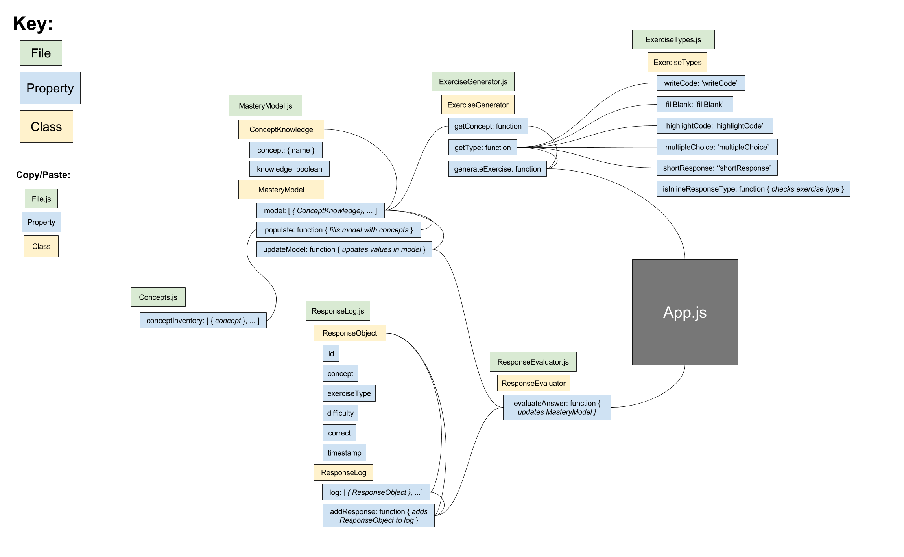
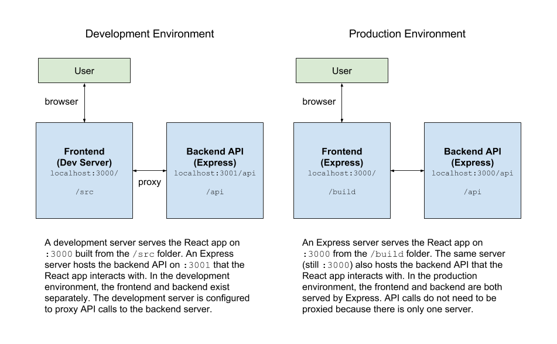

# architecture + design

> :evergreen_tree: _structurally sound!_ :evergreen_tree:

## File Structure

### Frontend

```
.
├── build               // built files are all contained here
│   ├── assets
│   └── static
│       ├── css
│       └── js
├── public              // contains user assets (images, html)
│   └── assets
└── src                 // all frontend JavaScript and SCSS are in '/src'
    ├── backend         // contains "pseudo-backend" logic classes ('C' of "MVC")
    ├── data            // contains datatype classes ('M' of "MVC")
    ├── stories         // contains Storybook "stories"
    ├── tests           // contains unit tests
    └── ui              // contains React components ('V' of "MVC")
        ├── components  // React components that make up individual parts of the view
        └── containers  // React components that hold logic to display components within them
```

### Backend (deprecated for now, as of August 2018)

```
.
└── api                 // all backend files are in '/api'
    ├── bin             // contains scripts
    ├── controllers     // contains the 'C' of "MVC" (it's in the name!)
    ├── java            // contains all resources for Java compilation/execution
    │   └── tmp         
    └── routes          // contains Express routes for API endpoints
```

### Development

```
.
├── dev                 // contains built documentation and storybook files
│   ├── docs
│   └── storybook
├── docs                // contains GitHub markdown documentation (like this file)
│   └── imgs
└── flow-typed          // contains Flow type stubs to prevent errors (mostly auto-generated)
```

## Diagrams

### Pseudo-backend diagram (outdated):



### Express and React relationship diagram:


